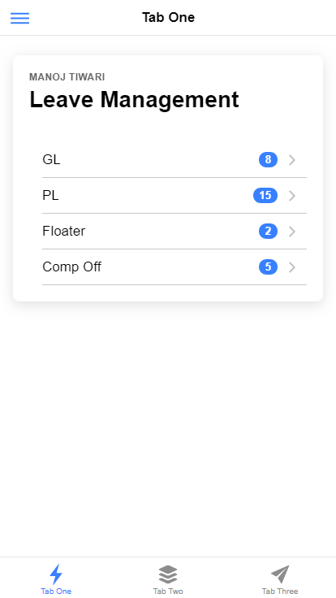
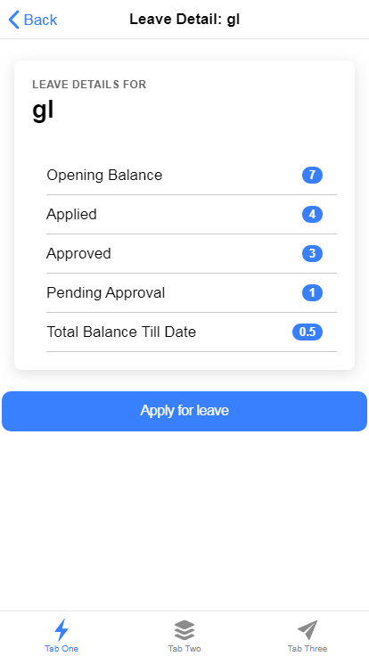
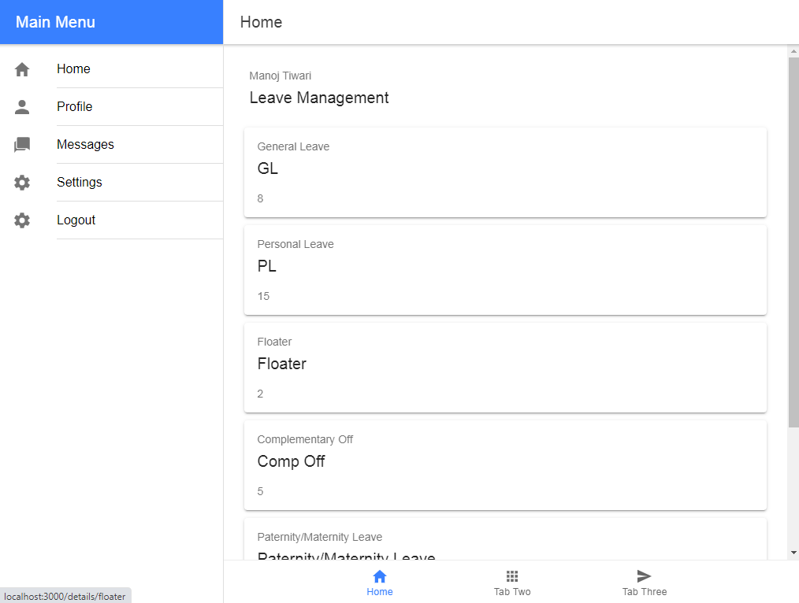
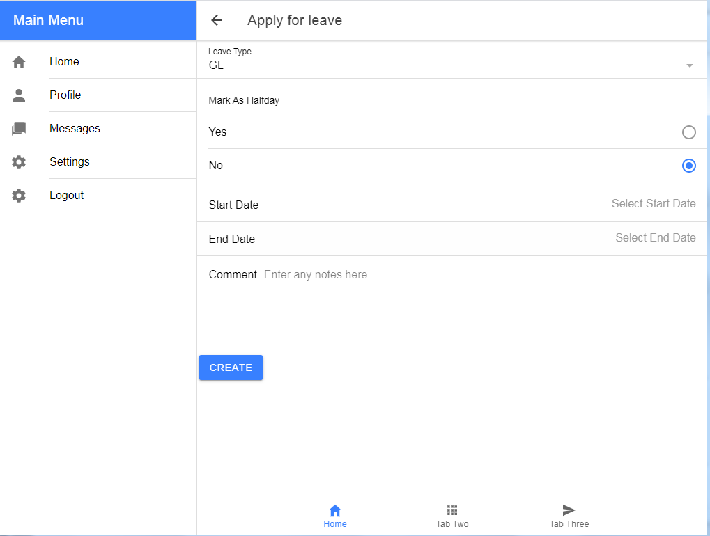

# ionic-react-kitapp

> Ionic + React boilerplate app kit

## A simple leave management app

### Mobile view





### Tablet view





**Getting Started**

> Note: The first official version of Ionic React is v4.11.

Enough with the backstory, how do you actually start building with Ionic React?

Getting started with Ionic React is easy. First, if you haven't already done so, install the latest Ionic CLI:

```terminal
$ node -v
> v10.24.1

$ npm -v
> 6.14.12

$ npm i -g ionic
```

Then, create a new project:

```terminal
$ npm create-react-app my-ionic-app --typescript
```

Go inside newly created project folder

```terminal
$ cd my-ionic-app
```

```terminal
$ ionic start my-react-app
```

The CLI will guide you through the setup process by first asking a couple of questions. The first of which is what framework you would like to use, select React (of course!).

Next, the CLI will ask which starter template you would like to use. We ship a few different starters to help get you up and running quickly. Go ahead and choose tabs for this demo:

The CLI will now create your app and install all the dependencies. Once it is done, go into the directory and launch the app:

```terminal
$ ionic serve
```

`http://localhost:8100/`

Each Ionic app starts with the IonApp component, which is the base container, and helps set up the screen to work great on both mobile and desktop. Next, the IonReactRouter component is a wrapper around the React Router library's BrowserRouter component. To do the native-like page transitions and to maintain the state of the pages as you browse through your app, we augment React Router with some additional functionality. Visit our Navigation & Routing guide for more info on how routing works in Ionic React.

The bulk of our tabs starter is now in the IonTabs component. The IonRouterOutlet contains a series of Routes (from React Router) for each of the pages in the tab interface.

Next, the IonTabBar component contains the bottom tab bar with a button for each of the pages, which forward to the Tab1, Tab2, and Tab3 components in the src/pages folder. The Tab1 and Tab2 pages have good examples on how to use some common Ionic components, but the Tab3 page is relatively bare. Let's change that.

We will set up our empty tab to be a page to show a list of employees, with some demo data being pulled from the UIFaces project.

First, let's update the tab bar in App.tsx to show a new label and icon:

```tsx
<IonTabButton tab="tab3" href="/tab3">
    <IonIcon icon={people} />
    <IonLabel>Employees</IonLabel>
</IonTabButton>
```

> The `people` icon is imported from 'ionicons/icons'

Open up `Tab3.tsx`, and replace the contents of the file with:

```tsx
import { IonAvatar, IonContent, IonHeader, IonItem, IonLabel, IonList, IonPage, IonTitle, IonToolbar, useIonViewWillEnter } from '@ionic/react';
import React, { useState } from 'react';

interface Person {
  name: string;
  email: string;
  position: string;
  photo: string;
}

const Tab3Page: React.FC = () => {

  const [people, setPeople] = useState<Person[]>([]);

  useIonViewWillEnter(async () => {
    const result = await fetch('https://uifaces.co/api?limit=25', {
      headers: { 'x-API-KEY': '873771d7760b846d51d025ac5804ab' }
    });
    const data = await result.json();
    setPeople(data);
  });

  return (
    <IonPage>
      <IonHeader>
        <IonToolbar>
          <IonTitle>Employees</IonTitle>
        </IonToolbar>
      </IonHeader>
      <IonContent>
        <IonList>
          {people.map((person, idx) => <EmployeeItem key={idx} person={person} />)}
        </IonList>
      </IonContent>
    </IonPage>
  );
};

const EmployeeItem: React.FC<{ person: Person }> = ({ person }) => {
  return (
    <IonItem >
      <IonAvatar slot="start">
        
      </IonAvatar>
      <IonLabel>
        <h2>{person.name}</h2>
        <p>{person.position}</p>
      </IonLabel>
    </IonItem>
  );
}

export default Tab3Page;
```

First, we define a TypeScript interface for a Person, which will give us some type safety and code completion when using the employees a bit later on.

At the top, we import a couple of React hooks to use, the first is useState, which allows us to use state in our functional components, and the second is useIonViewWillEnter, which is a lifecycle method provided by Ionic that will fire each time the view comes into view. Find out more about Ionic lifecycle methods here.

We provide a function to the useIonViewWillEnter hook that will fire that will call into the UIFaces API (using the fetch API) and return a list of twenty-five people. When the fetch request finishes, we call setPeople to update the people state variable.

In the JSX, we have an 'IonList' component, which contains an EmployeeItem for each of the people. We separate out the EmployeeItem into its own component (defined a bit farther down).

With the updates to Tab3, we can now get a list of employees:


That is the basics on getting up and running with an Ionic React app! For a more in-depth tutorial, check out our getting started guide.
Thanks

We're thrilled about Ionic React, and can't wait to see what you build with it. We've got a lot planned for Ionic React, so let us know in the comments below what type of content you'd like to see us cover. You can also reach out on Twitter by following us @ionicframework!

Until next time.

### Getting started guide : https://ionicframework.com/docs/react/your-first-app

### Docs : https://ionicframework.com/docs/

### Ionic UI Components : https://ionicframework.com/docs/components

&copy; 2021 **egor0518** MIT

All Rights Reserved
